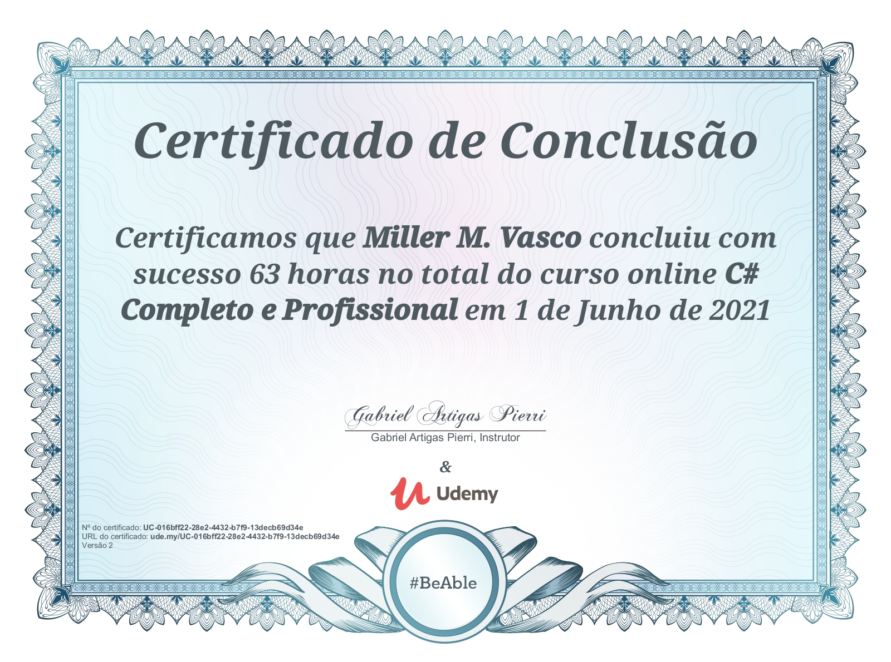

# Curso C# Completo e Profissional  
### Professor Gabriel Artigas

Bem-vindo ao meu repositório onde estou registrando todos os meus estudos e exercícios do curso de **C# (.NET)** ministrado pelo *Professor Gabriel Artigas*.

Nesta coleção você encontrará vários projetos e exemplos práticos que acompanham o aprendizado da linguagem.

---

## 📁 Estrutura do Repositório

Aqui estão as pastas que representam os módulos e exercícios já concluídos:

### 🔹 Conceitos Básicos e POO
- `ClassesObjetos` – Estudos sobre classes e objetos  
- `ClassesStaticas` – Uso de classes estáticas  
- `Encapsulamento` – Encapsulamento de dados e propriedades  
- `Heranca` – Herança entre classes  
- `Polimorfismo` – Polimorfismo em C#  
- `Propiedades` – Propriedades auto-implementadas  
- `TermoThis` – Uso do `this`

### 🔹 Estruturas e Lógica
- `FatorialRecursivo` – Exemplo de recursão com fatorial  
- `Recursividade` – Outros exemplos de recursão  
- `MediaGeralPOO` – Cálculo de médias em POO  
- `MetodoConstrutor` – Construtores de classe  
- `MetodoMain` – Estrutura principal do programa  
- `MetodosDasClasses` – Métodos dentro de classes  
- `Modificadores` – Modificadores de acesso  
- `TipoDelegate` – Delegates em C#

### 🔹 Testes e Outros
- `Teste` – Testes diversos de lógica e funcionalidades  
- `PropiedadesDasForms` – Propriedades usadas em formulários (WinForms)

### 📄 Arquivos importantes
- `.gitignore` – Arquivos ignorados pelo Git  
- `.gitattributes` – Atributos do repositório  
- `Curso.sln` – Solução principal do curso

---

## 📸 Certificado (Conquistas)

Abaixo está o certificado que eu recebi durante o curso:



---

## 🧠 Sobre o Curso

Este repositório é um **diário de aprendizado em C#**, cobrindo desde os fundamentos da linguagem até conceitos mais avançados com prática constante. A ideia é acompanhar o desenvolvimento dos meus conhecimentos à medida que avanço nas aulas e exercícios.

---

## 📌 Como Usar

1. Clone o repositório:
   ```bash
   git clone https://github.com/xX-Mill3r-Xx/CursoCSharp_GabrielArtigas.git
````

2. Abra a solução `Curso.sln` no Visual Studio ou outro editor compatível com C#.
3. Explore cada pasta para ver os respectivos exercícios e exemplos.

---

## ⭐ Contribuições

Este projeto é pessoal, mas contribuições e sugestões são bem-vindas!
Sinta-se à vontade para discutir melhorias por meio de *Issues* ou *Pull Requests*.

---

> Obrigado por visitar meu repositório! 🚀
> Aprender C# está sendo uma experiência incrível e este espaço representa cada passo dessa jornada.

```

---
